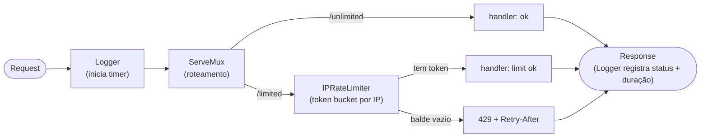

# HTTP Rate Limiter — Middleware Pattern em Go

Uma pequena API HTTP que demonstra o padrão **middleware** em Go, usando como caso concreto um rate limiter por IP. O foco não é a API em si, e sim a técnica que sustenta logging, auth, CORS, tracing e rate limiting em praticamente todo serviço Go de produção:

> Como adicionar comportamento transversal (logar, limitar, autenticar) a handlers HTTP **sem poluir a lógica de cada rota** — e de forma componível?

A resposta é o middleware: composição de funções aplicada à interface `http.Handler`.

## Conceitos de Go praticados

- Middleware pattern (`func(http.Handler) http.Handler`)
- Composição de middlewares (modelo "cebola")
- Decorator aplicado ao `http.ResponseWriter` (embedding + override de método)
- Token bucket via `golang.org/x/time/rate`
- Estado concorrente: mapa `IP → limiter` protegido por mutex
- Goroutine de limpeza para evitar memory leak
- Closures capturando dependências

## Arquitetura

Um middleware é uma função que **recebe o próximo handler e devolve um novo handler que o embrulha**:

```go
func(next http.Handler) http.Handler
```

Dentro do embrulho você faz coisas *antes* de chamar `next.ServeHTTP(w, r)` (iniciar um cronômetro, checar o token bucket) e/ou *depois* (logar o status). A imagem certa é uma **cebola**: a requisição entra de fora pra dentro pelas camadas, chega no handler, e a resposta volta desenrolando na ordem inversa. Por isso a ordem em que se encadeia importa.



Neste projeto o `Logger` embrulha o mux inteiro (loga toda requisição, inclusive 404s), e o `IPRateLimiter` embrulha só a rota `/limited`.

## Decisões de design

### Middleware é composição de funções
A peça que torna tudo componível é a interface `http.Handler`, com um único método `ServeHTTP`. Cada middleware fecha sobre suas dependências (o limiter, por exemplo) via closure e devolve um novo handler. Encadear é só aninhar: `Logger(RateLimiter(handler))`.

### Decorando o `ResponseWriter` para capturar o status
O `http.ResponseWriter` é via de mão única: você escreve o status com `WriteHeader`, mas não há como lê-lo de volta. Para logar o código de resposta, embrulhamos o writer num tipo que intercepta a escrita:

```go
type statusRecorder struct {
	http.ResponseWriter // embedding: satisfaz a interface de graça
	status int
}

func (s *statusRecorder) WriteHeader(code int) {
	s.status = code            // captura
	s.ResponseWriter.WriteHeader(code) // repassa pro writer real
}
```

Detalhes que importam:
- **Embedding** promove todos os métodos do `ResponseWriter`, então só precisamos sobrescrever o `WriteHeader`.
- O `status` é inicializado em `200`, porque o `net/http` escreve `200 OK` implicitamente quando o handler nunca chama `WriteHeader`.
- **Lição que custou caro:** sobrescrever um método via embedding só funciona se o nome bater *exatamente*. Um `writeHeader` (minúsculo) não sobrescreve o `WriteHeader` da interface — o método promovido do tipo embutido vence silenciosamente, sem erro de compilação, e o status fica preso em 200.

### Token bucket
O rate limit usa o algoritmo token bucket via `golang.org/x/time/rate`. Um balde de capacidade `B` é reabastecido a `R` tokens/segundo; cada requisição gasta um token, e sem token vem `429`. Isso permite **rajadas** curtas (até `B`) mas limita a taxa **sustentada** a `R`. Aqui: `rate.NewLimiter(rate.Every(5*time.Second), 10)` → 10 de rajada, depois 1 a cada 5s.

### Rate limit por IP: estado concorrente com ciclo de vida
Um limiter global seria um balde único compartilhado — um cliente agressivo derrubaria todos. A versão útil é **por IP**, o que traz dois problemas novos:

1. **Acesso concorrente** ao mapa `IP → limiter` (várias requisições em paralelo) → `sync.Mutex`.
2. **Crescimento ilimitado de memória** (cada IP novo cria uma entrada) → uma goroutine de limpeza expira visitantes inativos.

```go
func (l *ipLimiter) getLimiter(ip string) *rate.Limiter {
	l.mu.Lock()
	defer l.mu.Unlock()
	v, ok := l.visitors[ip]
	if !ok {
		lim := rate.NewLimiter(l.r, l.b)
		l.visitors[ip] = &visitor{limiter: lim, lastSeen: time.Now()}
		return lim
	}
	v.lastSeen = time.Now()
	return v.limiter
}
```

Usamos `Mutex` (não `RWMutex`) porque `getLimiter` **sempre escreve** (atualiza `lastSeen` ou insere) — não há leitura pura que justifique o RW. E o `.Allow()` é chamado *fora* do lock do mapa: o `*rate.Limiter` tem o próprio mutex interno, então segurar o lock do mapa durante o `Allow()` só criaria contenção à toa.

### Pegando o IP do cliente
`r.RemoteAddr` vem como `host:porta`, então extraímos o host com `net.SplitHostPort`. Atrás de um proxy, o IP real estaria em `X-Forwarded-For` — mas como esse header é falsificável, só se deve confiar nele atrás de um proxy conhecido.

### Boas práticas de resposta
O `429` inclui o header `Retry-After`, e ele é setado **antes** do `http.Error` — header escrito depois do `WriteHeader` é ignorado.

## Estrutura do projeto

```
rate-limiter/
├── main.go              # bootstrap: cria o mux, monta a Api, sobe o servidor
├── api/
│   ├── api.go           # Api struct, NewApi (registra rotas + middlewares), Run
│   ├── middleware.go    # Logger + statusRecorder, RateLimiter (limiter global)
│   └── iplimiter.go     # ipLimiter, getLimiter, Cleanup, IPRateLimiter, clientIP
└── go.mod
```

## Como rodar

```bash
go run .
# servidor no ar em :8000
#   GET /unlimited  -> "ok"        (sem limite)
#   GET /limited    -> "limit ok"  (rate limit por IP)
```

## Como testar

Dispare 11 requisições rápidas para `/limited`:

```bash
for i in $(seq 1 11); do curl -s -o /dev/null -w "%{http_code}\n" localhost:8000/limited; done
```

As 10 primeiras retornam `200` (a rajada do balde), a 11ª retorna `429`. Depois, 1 token é liberado a cada 5 segundos.

> Rodando tudo local, todas as requisições vêm do mesmo IP (`127.0.0.1`) e dividem o mesmo balde — você vê a rajada, mas não a *isolação* entre IPs. Para observar a isolação de verdade seriam necessários IPs de origem diferentes.

## Possíveis extensões

- **Sliding window** implementado na mão, sem o `x/time/rate`, para entender o algoritmo por dentro.
- **Rate limit distribuído** com Redis, para funcionar com múltiplas instâncias do serviço.
- **`Retry-After` dinâmico** calculado a partir do `Reserve().Delay()` do limiter, em vez de um valor fixo.

## Stack

- [Go](https://go.dev/)
- [golang.org/x/time/rate](https://pkg.go.dev/golang.org/x/time/rate) — implementação de token bucket